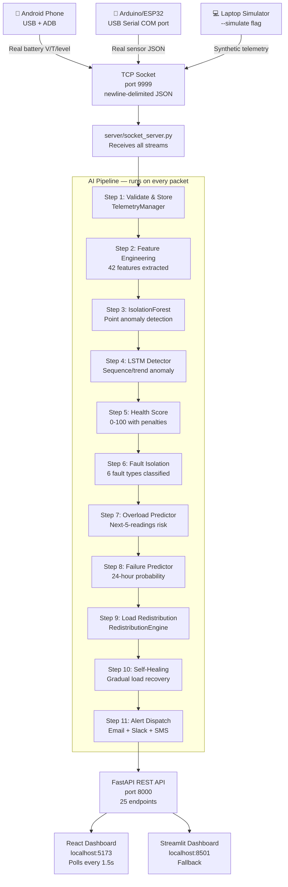
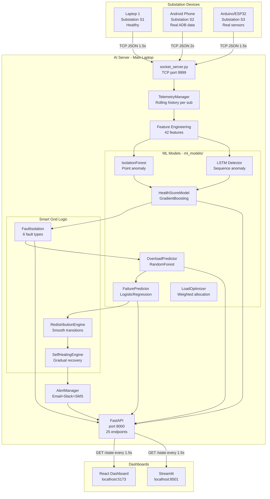
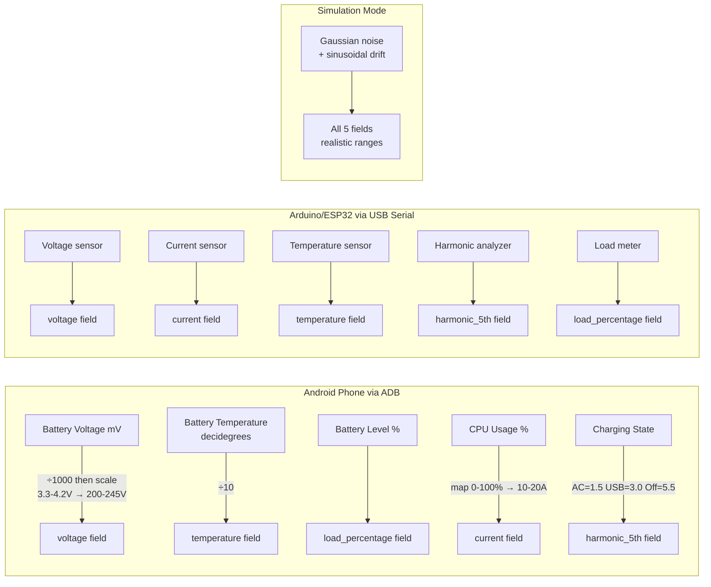
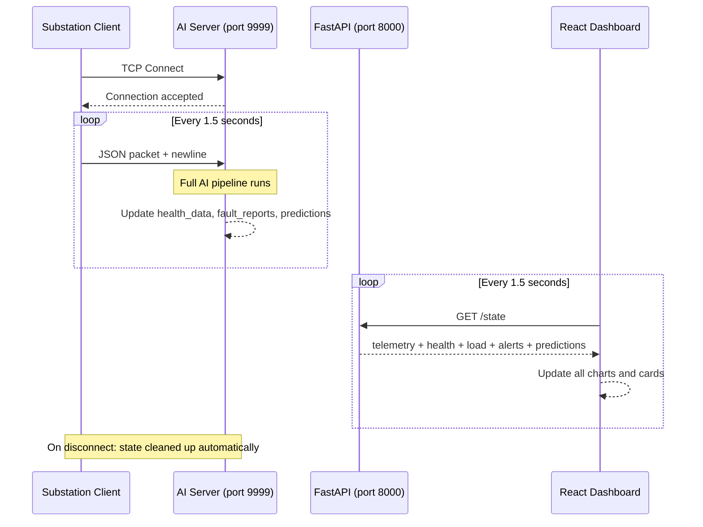
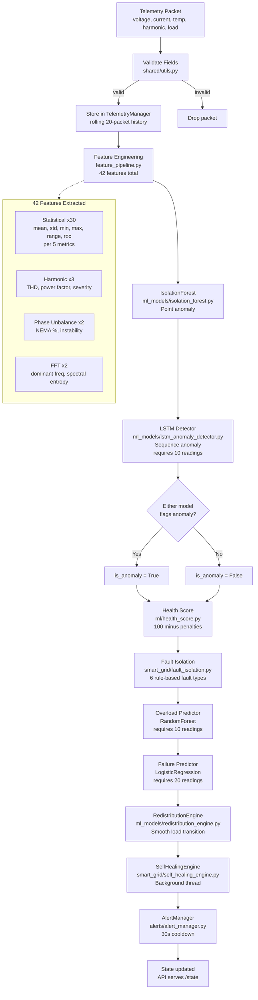

# ⚡ Industrial Smart Grid AI

> A distributed AI-powered smart grid simulation and real-time monitoring system.
> Multiple devices stream live electrical telemetry to a central AI server that runs
> anomaly detection, health scoring, fault isolation, predictive maintenance, and
> automatic load balancing — all displayed on a live React dashboard.

[](https://python.org)
[](https://fastapi.tiangolo.com)
[](https://react.dev)
[](https://scikit-learn.org)

---

## Table of Contents

1. [What This System Does](#1-what-this-system-does)
2. [End-to-End System Flow](#2-end-to-end-system-flow)
3. [System Architecture](#3-system-architecture)
4. [Data Sources — Where S1/S2/S3 Data Comes From](#4-data-sources)
5. [Communication Protocol](#5-communication-protocol)
6. [AI Pipeline — Step by Step](#6-ai-pipeline)
7. [All ML Models](#7-all-ml-models)
8. [Health Score System](#8-health-score-system)
9. [Load Balancing & Self-Healing](#9-load-balancing--self-healing)
10. [Alert System](#10-alert-system)
11. [Quick Start](#11-quick-start)
12. [Distributed Multi-Device Setup](#12-distributed-multi-device-setup)
13. [Android Phone via ADB — Step by Step](#13-android-phone-via-adb)
14. [Arduino / ESP32 via USB — Step by Step](#14-arduino--esp32-via-usb)
15. [API Reference](#15-api-reference)
16. [Dashboard](#16-dashboard)
17. [Project Structure](#17-project-structure)
18. [Configuration](#18-configuration)
19. [Docker Deployment](#19-docker-deployment)
20. [Tech Stack](#20-tech-stack)

---

## 1. What This System Does

This project simulates a real industrial smart grid where multiple devices act as virtual electrical substations. Each device streams live sensor data to a central AI server that:

- Detects anomalies using **IsolationForest** (point-based) and **LSTM** (sequence/trend-based)
- Calculates a **health score (0–100)** for each substation every 1.5 seconds
- Classifies **fault types** (overheat, voltage sag, overload, harmonics, overcurrent)
- **Predicts overload** risk in the next 5 readings using RandomForest
- **Predicts transformer failure** probability over 24 hours using Logistic Regression
- **Automatically redistributes load** away from failing substations
- **Self-heals** by gradually restoring load as substations recover
- Sends **Email / Slack / SMS alerts** on critical events
- Displays everything on a **live React dashboard** with real-time charts

Think of it as a miniature SCADA + predictive maintenance platform.

---

## 2. End-to-End System Flow



---

## 3. System Architecture



---

## 4. Data Sources

**S1, S2, S3 are substation IDs** — labels you assign to each device. The actual data comes from whichever hardware you connect.



### Normal Operating Ranges

| Metric | Healthy Range | Warning | Critical |
|---|---|---|---|
| Voltage | 220–240 V | < 210V or > 245V | < 200V or > 250V |
| Current | 10–20 A | > 18A | > 22A |
| Temperature | 50–75 °C | > 75°C | > 85°C |
| Harmonics | 1–5 % | > 5% | > 8% |
| Load | 20–60 % | > 60% | > 80% |

---

## 5. Communication Protocol



### Packet Format

```json
{
  "substation_id":   "S1",
  "timestamp":       "2026-05-19T22:00:00.000000",
  "voltage":         230.5,
  "current":         14.2,
  "temperature":     62.1,
  "harmonic_5th":    3.5,
  "load_percentage": 35.0
}
```

Fields may be `null` — the AI pipeline handles partial sensor data gracefully.

---

## 6. AI Pipeline

Every telemetry packet triggers this full pipeline in under 50ms:



### Step-by-Step Explanation

**Step 1 — Validate & Store**
Every packet is checked for required fields. Valid packets go into `TelemetryManager` which keeps the latest reading and a 20-packet rolling history per substation.

**Step 2 — Feature Engineering (42 features)**
Raw 5 values are expanded to 42 features:
- 30 statistical features (mean, std, min, max, range, rate-of-change × 5 metrics)
- 3 harmonic features (THD approximation, power factor estimate, severity index)
- 2 phase unbalance features (NEMA unbalance %, voltage instability coefficient)
- 2 FFT features (dominant frequency magnitude, spectral entropy)

**Step 3 — IsolationForest (point anomaly)**
Trained on 500 synthetic normal samples at startup. Saved to disk, reloaded on restart. Phone battery voltage (< 10V) is auto-neutralised to prevent false positives.

**Step 4 — LSTM Detector (sequence anomaly)**
One detector per substation. Looks at the last 10 readings as a sequence. Catches gradual drift that looks normal point-by-point but is anomalous as a trend. Combined with IsolationForest: anomaly if either model flags it.

**Step 5 — Health Score**
Starts at 100, applies rule-based penalties. −30 if ML anomaly detected. Score determines status: Healthy (80–100), Warning (50–79), Critical (0–49).

**Step 6 — Fault Isolation**
Six rule-based fault types: Overheat, Voltage Sag, Voltage Surge, Overload, Harmonic Distortion, Overcurrent. Multiple faults can fire simultaneously.

**Step 7 — Overload Prediction**
RandomForest trained on 1500 synthetic sequences. Predicts overload risk in the next 5 readings. Triggers a WARNING alert if probability > 75%.

**Step 8 — Transformer Failure Prediction**
Logistic Regression trained on 2000 sequences. Predicts 24-hour failure probability from 17 stress features (thermal cycles, voltage sag count, harmonic stress, etc.).

**Step 9 — Load Redistribution**
`RedistributionEngine` detects status changes, calls `LoadOptimizer` for optimal distribution, applies it gradually over 10 seconds (5 steps × 2s) with 15-second cooldown.

**Step 10 — Self-Healing**
Background thread checks every 10 seconds. When health rises above 70, load is restored +5% per cycle until the substation reaches its fair share.

**Step 11 — Alert Dispatch**
CRITICAL alerts trigger Email + Slack + SMS in parallel background threads. 30-second cooldown per substation prevents spam.

---
