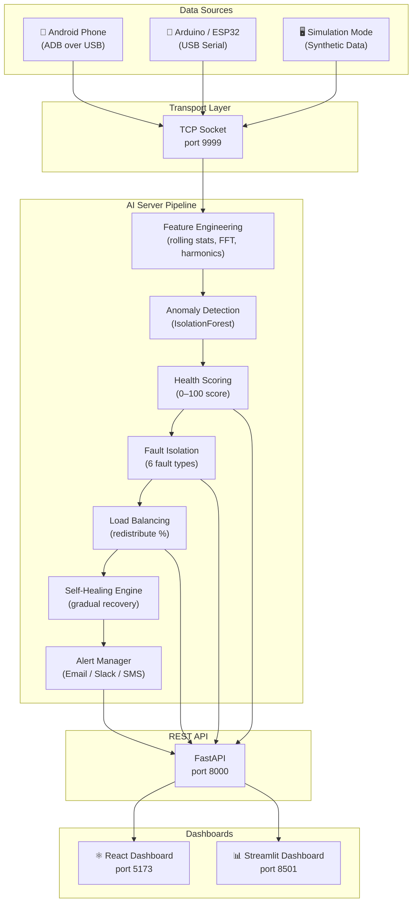
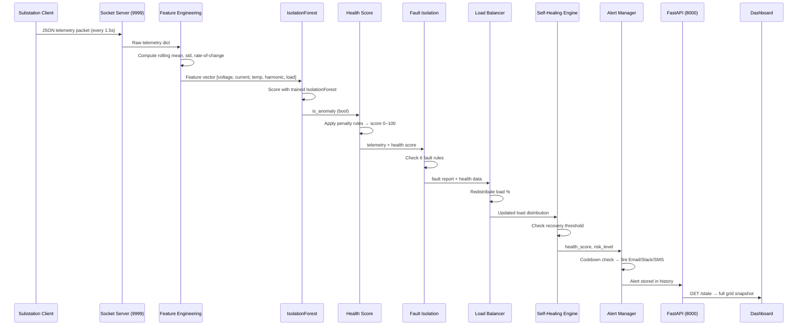
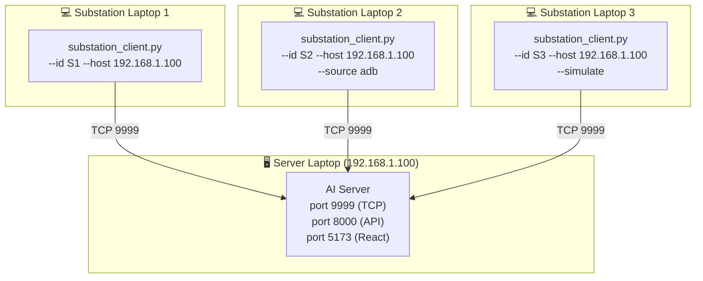
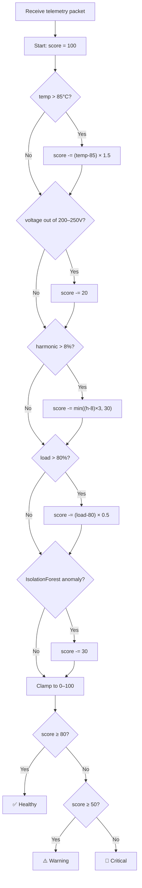
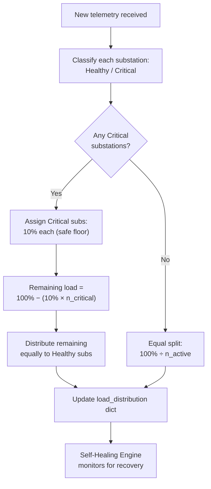
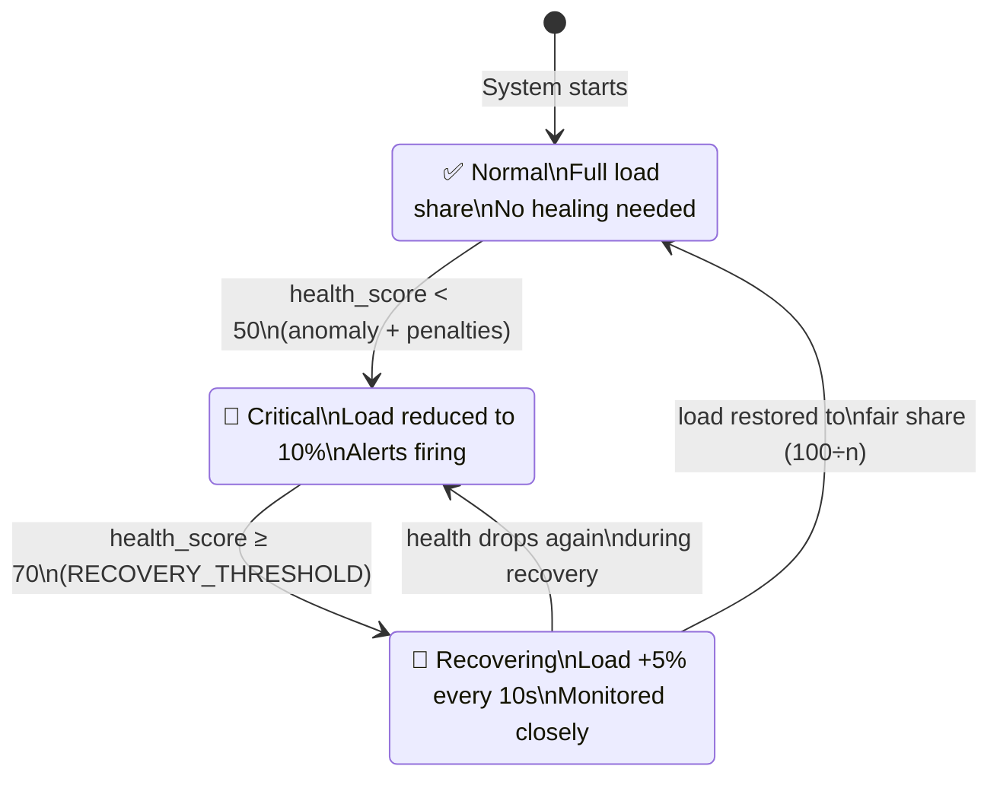

# ⚡ Industrial Smart Grid AI

[](https://python.org)
[](https://fastapi.tiangolo.com)
[](https://react.dev)
[](https://scikit-learn.org)
[](LICENSE)

> A distributed, AI-powered smart grid monitoring system that ingests real-time telemetry from physical sensors (Android phones, Arduino/ESP32, or simulation), detects anomalies with machine learning, scores substation health, isolates faults, rebalances load, and self-heals — all visualised on a live React + Streamlit dashboard.

---

## Table of Contents

1. [What Is This?](#1-what-is-this)
2. [System Architecture](#2-system-architecture)
3. [AI Pipeline Flow](#3-ai-pipeline-flow)
4. [Data Sources](#4-data-sources)
5. [Prerequisites](#5-prerequisites)
6. [Installation](#6-installation)
7. [Running the System](#7-running-the-system)
8. [Telemetry Packet Format](#8-telemetry-packet-format)
9. [Health Score System](#9-health-score-system)
10. [Fault Types](#10-fault-types)
11. [Load Redistribution](#11-load-redistribution)
12. [Self-Healing Engine](#12-self-healing-engine)
13. [API Reference](#13-api-reference)
14. [Dashboard Guide](#14-dashboard-guide)
15. [Alert Channels](#15-alert-channels)
16. [Project Structure](#16-project-structure)
17. [Configuration Reference](#17-configuration-reference)
18. [Docker Deployment](#18-docker-deployment)
19. [Tech Stack](#19-tech-stack)
20. [Troubleshooting](#20-troubleshooting)
21. [Contributing & License](#21-contributing--license)

---

## 1. What Is This?

### What is a Smart Grid?

A traditional power grid sends electricity in one direction — from a power plant to your home. A **smart grid** adds two-way communication: sensors at every substation continuously report voltage, current, temperature, and load back to a central system. That system can then detect problems, reroute power, and even fix itself — all automatically.

### What does this project do?

This project simulates and monitors a **distributed industrial smart grid** with multiple substations. Each substation streams live telemetry data to a central AI server. The server:

- **Detects anomalies** using a trained IsolationForest model
- **Scores health** of each substation on a 0–100 scale
- **Isolates faults** by classifying what went wrong (overheat, voltage sag, overload, etc.)
- **Rebalances load** by shifting work away from struggling substations
- **Self-heals** by gradually restoring load as a substation recovers
- **Fires alerts** via Email, Slack, or SMS when things go critical
- **Visualises everything** on a live React dashboard and a Streamlit analytics view

### Role of each component

| Component | Role |
|---|---|
| **Substation Client** | Reads sensor data and streams it over TCP to the AI server |
| **Socket Server** | Receives telemetry packets and feeds them into the AI pipeline |
| **AI Pipeline** | Feature engineering → anomaly detection → health scoring → fault isolation |
| **Load Balancer** | Redistributes load % across substations based on health |
| **Self-Healing Engine** | Gradually restores load to recovering substations |
| **Alert Manager** | Sends Email/Slack/SMS notifications on critical events |
| **FastAPI Backend** | Exposes all grid state via a REST API |
| **React Dashboard** | Live visual interface at `http://localhost:5173` |
| **Streamlit Dashboard** | Analytics and monitoring view at `http://localhost:8501` |

---

## 2. System Architecture



---

## 3. AI Pipeline Flow



---

## 4. Data Sources

### A. Android Phone via ADB

Your Android phone becomes a real sensor. The ADB client reads live battery and CPU data and maps it to grid telemetry fields.

**Sensor Mapping Table**

| Phone Sensor | Grid Field | Mapping Formula |
|---|---|---|
| Battery voltage (mV) | `voltage` | `200 + ((batt_v - 3.3) / (4.2 - 3.3)) * 45` → 200–245 V |
| Battery temperature (decidegrees) | `temperature` | `raw / 10` → real °C |
| Battery level (%) | `load_percentage` | Direct (0–100%) |
| CPU usage (%) | `current` | `10 + (cpu_pct / 100) * 10` → 10–20 A |
| Charging state | `harmonic_5th` | AC charging=1.5, USB=3.0, Discharging=5.5 |

**Step-by-step setup**

1. On your Android phone, go to **Settings → About Phone** and tap **Build Number** 7 times to unlock Developer Options.
2. Go to **Settings → Developer Options** and enable **USB Debugging**.
3. Connect your phone to your laptop with a USB cable.
4. When the phone shows a prompt asking *"Allow USB Debugging?"*, tap **Allow**.
5. Verify the phone is detected:
   ```bash
   platform-tools\adb.exe devices
   # Should show: <serial>    device
   ```
6. Run the ADB substation client:
   ```bash
   python substations/substation_client.py --id S1 --source adb
   ```

---

### B. Arduino / ESP32 via USB Serial

Any microcontroller that can send serial JSON works. The client auto-detects the COM port.

**Expected JSON format** (sent every ~1 second at 9600 baud):

```json
{"voltage": 230.1, "current": 15.2, "temperature": 60.5, "harmonic_5th": 2.1, "load_percentage": 45.0}
```

- Terminate each line with `\n`
- Baud rate: **9600** (configurable with `--baud`)
- Protocol: **USB Serial / UART**
- Missing fields are accepted — the server flags them but still processes the packet

**List available ports:**
```bash
python substations/substation_client.py --list-ports
```

**Run with auto-detected port:**
```bash
python substations/substation_client.py --id S1 --host 192.168.1.100
```

**Run with explicit port:**
```bash
python substations/substation_client.py --id S1 --host 192.168.1.100 --port-name COM3
# Linux/Mac:
python substations/substation_client.py --id S1 --host 192.168.1.100 --port-name /dev/ttyUSB0
```

---

### C. Simulation Mode

Generates realistic synthetic telemetry using `TelemetryGenerator`. Optionally injects faults with `FaultSimulator`.

**When to use:** Development, demos, CI testing — any time you don't have physical hardware.

**Run simulation (clean data):**
```bash
python substations/substation_client.py --id S1 --simulate
```

**Run simulation with fault injection:**
```bash
python substations/substation_client.py --id S2 --simulate --faulty --fault-prob 0.3
```

**Run 3 simulated substations at once:**
```bash
python substations/substation_client.py --id S1 --simulate &
python substations/substation_client.py --id S2 --simulate --faulty &
python substations/substation_client.py --id S3 --simulate &
```

---

## 5. Prerequisites

| Requirement | Version | Notes |
|---|---|---|
| **Python** | 3.10+ | [python.org](https://python.org) |
| **Node.js** | 18+ | [nodejs.org](https://nodejs.org) — needed for the React dashboard |
| **Git** | Any | [git-scm.com](https://git-scm.com) |
| **ADB** | Any | Only needed for Android phone source. Already bundled in `platform-tools/` |
| **pyserial** | 3.5+ | Installed via `requirements.txt` — needed for USB serial source |

**Check your versions:**
```bash
python --version      # Python 3.10.x or higher
node --version        # v18.x or higher
git --version
```

---

## 6. Installation

### Step 1 — Clone the repository

```bash
git clone https://github.com/your-username/industrial-smart-grid-ai.git
cd industrial-smart-grid-ai
```

### Step 2 — Install Python dependencies

```bash
# Create and activate a virtual environment (recommended)
python -m venv .venv

# Windows
.venv\Scripts\activate

# macOS / Linux
source .venv/bin/activate

# Install all packages
pip install -r requirements.txt
```

### Step 3 — Install frontend dependencies

```bash
cd dashboard/frontend
npm install
cd ../..
```

### Step 4 — Copy `.env` and configure

```bash
# The .env file is already present in the repo root.
# Open it and fill in any optional values (email, Slack, SMS).
# The defaults work out of the box for local development.
```

Key variables to review:

```dotenv
SERVER_HOST=0.0.0.0       # AI server bind address
SERVER_PORT=9999           # TCP socket port
API_HOST=0.0.0.0
API_PORT=8000
VITE_API_BASE_URL=http://localhost:8000   # Change to server IP for multi-device setup
```

### Step 5 — (Optional) Verify ADB is available

ADB is already bundled in `platform-tools/`. To verify:

```bash
platform-tools\adb.exe version
# Or run the setup helper:
python setup_adb.py
```

---

## 7. Running the System

### A. Single Machine Quick Start

All three options below start the AI server + React dashboard on the same machine.

---

**Option 1 — With a real USB sensor (Arduino / ESP32)**

Terminal 1 — Start the AI server and dashboard:
```bash
python api/main.py
```

Terminal 2 — Start the React frontend:
```bash
cd dashboard/frontend
npm run dev
```

Terminal 3 — Start the USB substation client:
```bash
python substations/substation_client.py --id S1
```

---

**Option 2 — With an Android phone via ADB**

Terminal 1:
```bash
python api/main.py
```

Terminal 2:
```bash
cd dashboard/frontend && npm run dev
```

Terminal 3:
```bash
python substations/substation_client.py --id S1 --source adb
```

---

**Option 3 — Simulation mode (demo, no hardware needed)**

Terminal 1:
```bash
python api/main.py
```

Terminal 2:
```bash
cd dashboard/frontend && npm run dev
```

Terminal 3 — Start 3 simulated substations:
```bash
python substations/substation_client.py --id S1 --simulate
python substations/substation_client.py --id S2 --simulate --faulty
python substations/substation_client.py --id S3 --simulate
```

Terminal 4 — (Optional) Streamlit analytics dashboard:
```bash
streamlit run dashboard/app.py
```

---

**URLs after starting:**

| Service | URL |
|---|---|
| React Dashboard | http://localhost:5173 |
| FastAPI Swagger UI | http://localhost:8000/docs |
| FastAPI ReDoc | http://localhost:8000/redoc |
| Streamlit Dashboard | http://localhost:8501 |
| Raw API health check | http://localhost:8000/ |

---

### B. Distributed Multi-Device Setup

Run the AI server on one laptop and connect multiple substation laptops over your local network.



**Server laptop — step by step:**

1. Find your IP address on Windows:
   ```bash
   ipconfig
   # Look for "IPv4 Address" under your Wi-Fi or Ethernet adapter
   # Example: 192.168.1.100
   ```
2. Start the AI server:
   ```bash
   python api/main.py
   ```
3. Start the React dashboard:
   ```bash
   cd dashboard/frontend && npm run dev
   ```
4. Make sure Windows Firewall allows inbound connections on ports **9999** and **8000**.

**Each substation laptop — step by step:**

1. Clone the repo and install Python dependencies (Steps 1–2 from Installation).
2. Edit `dashboard/frontend/.env` and set:
   ```dotenv
   VITE_API_BASE_URL=http://192.168.1.100:8000
   ```
3. Run the substation client pointing at the server IP:
   ```bash
   # USB sensor:
   python substations/substation_client.py --id S2 --host 192.168.1.100

   # Android phone:
   python substations/substation_client.py --id S2 --host 192.168.1.100 --source adb

   # Simulation:
   python substations/substation_client.py --id S2 --host 192.168.1.100 --simulate
   ```

---

## 8. Telemetry Packet Format

Every substation client sends a newline-terminated JSON packet to the socket server every ~1.5 seconds.

**Example packet:**
```json
{
  "substation_id": "S1",
  "timestamp": "2024-01-15T10:30:45.123456",
  "voltage": 231.5,
  "current": 14.8,
  "temperature": 62.3,
  "harmonic_5th": 2.4,
  "load_percentage": 47.2
}
```

**Field reference:**

| Field | Type | Unit | Normal Range | Description |
|---|---|---|---|---|
| `substation_id` | string | — | S1, S2, S3… | Unique identifier for the substation |
| `timestamp` | string | ISO 8601 | — | UTC timestamp of the reading |
| `voltage` | float | Volts (V) | 220–240 V | Line voltage at the substation |
| `current` | float | Amperes (A) | 10–20 A | Current draw |
| `temperature` | float | Celsius (°C) | 50–75 °C | Equipment/transformer temperature |
| `harmonic_5th` | float | % THD | 1–5 % | 5th harmonic distortion (IEEE 519) |
| `load_percentage` | float | % | 20–60 % | Load as a percentage of rated capacity |

---

## 9. Health Score System

Each substation receives a health score from **0** (failed) to **100** (perfect) on every telemetry packet.

### Formula

```
score = 100.0
score -= temperature_penalty    (if temp > 85°C)
score -= voltage_penalty        (if voltage < 200V or > 250V)
score -= harmonic_penalty       (if harmonic_5th > 8%)
score -= load_penalty           (if load_percentage > 80%)
score -= anomaly_penalty        (if IsolationForest flags anomaly)
score = clamp(score, 0, 100)
```

### Penalty Table

| Condition | Penalty |
|---|---|
| Temperature > 85°C | `(temp - 85) × 1.5` per degree |
| Voltage < 200V or > 250V | −20 points flat |
| Harmonic distortion > 8% | `(harmonic - 8) × 3`, max −30 |
| Load percentage > 80% | `(load - 80) × 0.5` per % |
| IsolationForest anomaly detected | −30 points flat |

### Status Classification

| Score Range | Status | Meaning |
|---|---|---|
| 80–100 | ✅ **Healthy** | Normal operation |
| 50–79 | ⚠️ **Warning** | Degraded — monitor closely |
| 0–49 | 🔴 **Critical** | Fault condition — load reduced, alerts fired |

### Health Score Flowchart



---

## 10. Fault Types

The fault isolation engine checks every telemetry packet against 6 rule-based fault conditions.

| Fault Name | Trigger Condition | Severity | Description |
|---|---|---|---|
| **Overheat** | `temperature > 85°C` (TEMP_MAX + 10) | 🔴 HIGH | Transformer/equipment temperature exceeds safe operating limit |
| **Voltage Sag** | `voltage < 205V` (VOLTAGE_MIN − 15) | 🔴 HIGH | Voltage dropped significantly below nominal range |
| **Voltage Surge** | `voltage > 255V` (VOLTAGE_MAX + 15) | 🟡 MEDIUM | Voltage exceeded safe upper limit |
| **Overload** | `load_percentage > 80%` (LOAD_MAX + 20) | 🔴 HIGH | Load critically high — risk of equipment damage |
| **Harmonic Distortion** | `harmonic_5th > 8%` (HARMONIC_MAX + 3) | 🟡 MEDIUM | 5th harmonic distortion exceeds IEEE 519 limits |
| **Overcurrent** | `current > 25A` (CURRENT_MAX + 5) | 🔴 HIGH | Current draw exceeds rated capacity |

Multiple faults can be active simultaneously. The `highest_severity` field in the fault report reflects the worst active fault.

---

## 11. Load Redistribution

When a substation goes Critical, the load balancer shifts its work to healthy substations.

### Before / After Example

**Scenario:** S2 goes Critical (health score drops below 50).

| Substation | Before | After |
|---|---|---|
| S1 (Healthy) | 33.3% | 45.0% |
| S2 (Critical) | 33.3% | **10.0%** |
| S3 (Healthy) | 33.3% | 45.0% |

**Formula:**
- Critical substations receive a safe floor of **10%**
- Remaining load `(100 - 10 × n_critical)` is split equally among healthy substations

### Load Redistribution Diagram



---

## 12. Self-Healing Engine

The self-healing engine runs in a background thread and gradually restores load to substations that have recovered from a critical state.

### How it works

1. Every telemetry packet calls `notify_health(sub_id, health_score, risk_level)`.
2. If a substation is **Critical**, it is marked `recovering = False`.
3. When health rises above **70** (RECOVERY_THRESHOLD), the substation is marked `recovering = True`.
4. Every **10 seconds** (HEALING_INTERVAL), the healing loop runs:
   - For each recovering substation, load is increased by **5%** (RECOVERY_STEP).
   - This continues until the substation reaches its fair share (`100% ÷ n_active`).
   - Once fully restored, `recovering` is set back to `False`.
5. If health drops again during recovery, recovery is paused immediately.

### Self-Healing State Diagram



---

## 13. API Reference

The FastAPI backend exposes 21 endpoints. Interactive docs are available at `http://localhost:8000/docs`.

### System Endpoints

| Method | Path | Description |
|---|---|---|
| `GET` | `/` | Health check — returns service name and version |
| `GET` | `/state` | Full live grid state snapshot (polled by dashboards) |
| `GET` | `/summary` | System-wide health summary |

### Telemetry Endpoints

| Method | Path | Description |
|---|---|---|
| `GET` | `/telemetry/` | Latest telemetry for all connected substations |
| `GET` | `/telemetry/{sub_id}` | Latest telemetry for a specific substation |
| `GET` | `/telemetry/{sub_id}/history` | Rolling telemetry history (default last 20 readings) |

### Anomaly & Health Endpoints

| Method | Path | Description |
|---|---|---|
| `GET` | `/anomaly/health` | Health scores for all substations |
| `GET` | `/anomaly/health/{sub_id}` | Health score and anomaly status for one substation |
| `GET` | `/anomaly/summary` | Overall system health summary |
| `GET` | `/anomaly/faults` | Fault isolation reports for all substations |
| `GET` | `/anomaly/faults/{sub_id}` | Fault report for a specific substation |

### Load Balancing Endpoints

| Method | Path | Description |
|---|---|---|
| `GET` | `/load/distribution` | Current load % for all substations |
| `GET` | `/load/substations` | List of currently connected substations |
| `POST` | `/load/rebalance` | Manually trigger a load rebalance |

### Prediction & Explainability Endpoints

| Method | Path | Description |
|---|---|---|
| `POST` | `/predict/anomaly` | Run anomaly detection on a submitted packet |
| `POST` | `/predict/root-cause` | Run root cause analysis on a submitted packet |
| `GET` | `/predict/model-info` | Active ML model type, training status, features |

### Alert Endpoints

| Method | Path | Description |
|---|---|---|
| `GET` | `/alerts` | All recent alerts (default last 20) |
| `GET` | `/alerts/{sub_id}` | Alerts for a specific substation |
| `DELETE` | `/alerts` | Clear all alert history |

### USB Device Endpoints

| Method | Path | Description |
|---|---|---|
| `GET` | `/usb/status` | Connected COM ports + active substations |
| `GET` | `/usb/ports` | List all available COM/serial ports |

---

### Example curl commands

**Get full grid state:**
```bash
curl http://localhost:8000/state
```

**Get health scores:**
```bash
curl http://localhost:8000/anomaly/health
```

**Get load distribution:**
```bash
curl http://localhost:8000/load/distribution
```

**Manually trigger rebalance:**
```bash
curl -X POST http://localhost:8000/load/rebalance
```

**Run anomaly detection on a custom packet:**
```bash
curl -X POST http://localhost:8000/predict/anomaly \
  -H "Content-Type: application/json" \
  -d '{"voltage": 195.0, "current": 22.0, "temperature": 95.0, "harmonic_5th": 9.5, "load_percentage": 88.0}'
```

**Get recent alerts:**
```bash
curl "http://localhost:8000/alerts?limit=10"
```

**Clear all alerts:**
```bash
curl -X DELETE http://localhost:8000/alerts
```

---
